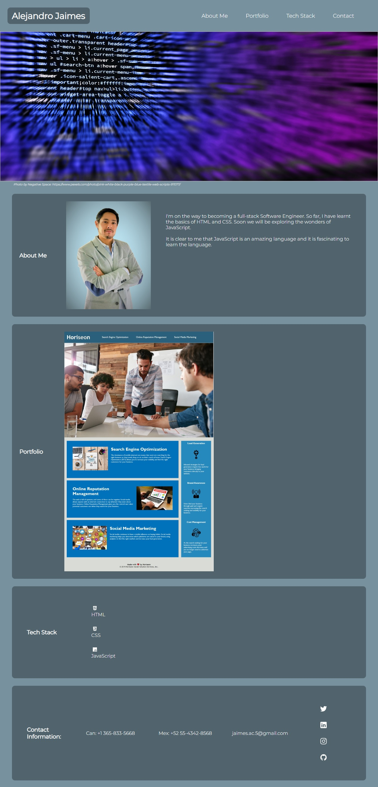

# AlexJCturbo Portfolio

First portfolio page with the course progress.

On this website, I publish the projects I am working on that will allow me to showcase my coding skills.

## Responsive website

Currently, I am working to make the website responsive to different devices.

## Links to the Portfolio Website and the GitHub Repository 

[Portfolio Website](https://alexjcturbo.github.io/portfolio/)

[GitHub Repository](https://github.com/AlexJCturbo/portfolio)